# Oracle PL/Sql

widoki, funkcje, procedury, triggery
ćwiczenie

---


Imiona i nazwiska autorów : Szymon Kłodowski, Adrian Krawczyk

---

# Tabele


- `Trip`  - wycieczki
	- `trip_id` - identyfikator, klucz główny
	- `trip_name` - nazwa wycieczki
	- `country` - nazwa kraju
	- `trip_date` - data
	- `max_no_places` -  maksymalna liczba miejsc na wycieczkę
- `Person` - osoby
	- `person_id` - identyfikator, klucz główny
	- `firstname` - imię
	- `lastname` - nazwisko


- `Reservation`  - rezerwacje/bilety na wycieczkę
	- `reservation_id` - identyfikator, klucz główny
	- `trip_id` - identyfikator wycieczki
	- `person_id` - identyfikator osoby
	- `status` - status rezerwacji
		- `N` – New - Nowa
		- `P` – Confirmed and Paid – Potwierdzona  i zapłacona
		- `C` – Canceled - Anulowana
- `Log` - dziennik zmian statusów rezerwacji 
	- `log_id` - identyfikator, klucz główny
	- `reservation_id` - identyfikator rezerwacji
	- `log_date` - data zmiany
	- `status` - status


```sql
create sequence s_person_seq  
   start with 1  
   increment by 1;

create table person  
(  
  person_id int not null
      constraint pk_person  
         primary key,
  firstname varchar(50),  
  lastname varchar(50)
)  

alter table person  
    modify person_id int default s_person_seq.nextval;
   
```


```sql
create sequence s_trip_seq  
   start with 1  
   increment by 1;

create table trip  
(  
  trip_id int  not null
     constraint pk_trip  
         primary key, 
  trip_name varchar(100),  
  country varchar(50),  
  trip_date date,  
  max_no_places int
);  

alter table trip 
    modify trip_id int default s_trip_seq.nextval;
```


```sql
create sequence s_reservation_seq  
   start with 1  
   increment by 1;

create table reservation  
(  
  reservation_id int not null
      constraint pk_reservation  
         primary key, 
  trip_id int,  
  person_id int,  
  status char(1)
);  

alter table reservation 
    modify reservation_id int default s_reservation_seq.nextval;


alter table reservation  
add constraint reservation_fk1 foreign key  
( person_id ) references person ( person_id ); 
  
alter table reservation  
add constraint reservation_fk2 foreign key  
( trip_id ) references trip ( trip_id );  
  
alter table reservation  
add constraint reservation_chk1 check  
(status in ('N','P','C'));

```


```sql
create sequence s_log_seq  
   start with 1  
   increment by 1;


create table log  
(  
    log_id int not null
         constraint pk_log  
         primary key,
    reservation_id int not null,  
    log_date date not null,  
    status char(1)
);  

alter table log 
    modify log_id int default s_log_seq.nextval;
  
alter table log  
add constraint log_chk1 check  
(status in ('N','P','C')) enable;
  
alter table log  
add constraint log_fk1 foreign key  
( reservation_id ) references reservation ( reservation_id );
```


---
# Dane


Należy wypełnić  tabele przykładowymi danymi 
- 4 wycieczki
- 10 osób
- 10  rezerwacji

Dane testowe powinny być różnorodne (wycieczki w przyszłości, wycieczki w przeszłości, rezerwacje o różnym statusie itp.) tak, żeby umożliwić testowanie napisanych procedur.

W razie potrzeby należy zmodyfikować dane tak żeby przetestować różne przypadki.


```sql
-- trip
insert into trip(trip_name, country, trip_date, max_no_places)
values ('Wycieczka do Paryza', 'Francja', to_date('2023-09-12', 'YYYY-MM-DD'), 5);

insert into trip(trip_name, country, trip_date,  max_no_places)
values ('Piekny Krakow', 'Polska', to_date('2025-05-03','YYYY-MM-DD'), 3);

insert into trip(trip_name, country, trip_date,  max_no_places)
values ('Znow do Francji', 'Francja', to_date('2025-05-01','YYYY-MM-DD'), 2);

insert into trip(trip_name, country, trip_date,  max_no_places)
values ('Hel', 'Polska', to_date('2025-05-01','YYYY-MM-DD'),  2);

-- person
insert into person(firstname, lastname)
values ('Jan', 'Nowak');

insert into person(firstname, lastname)
values ('Jan', 'Kowalski');

insert into person(firstname, lastname)
values ('Jan', 'Nowakowski');

insert into person(firstname, lastname)
values  ('Novak', 'Nowak');

insert into person(firstname, lastname)
values ('Adrian', 'Nowak');

insert into person(firstname, lastname)
values ('Adrian', 'Kowalski');

insert into person(firstname, lastname)
values ('Adrian', 'Nowakowski');

insert into person(firstname, lastname)
values  ('Szymon', 'Nowak');

insert into person(firstname, lastname)
values ('Szymon', 'Nowakowski');

insert into person(firstname, lastname)
values ('Szymon', 'Kowalski');

-- reservation
-- trip1
insert  into reservation(trip_id, person_id, status)
values (1, 1, 'P');

insert into reservation(trip_id, person_id, status)
values (1, 2, 'N');

insert into reservation(trip_id, person_id, status)
values (1, 3, 'C');

-- trip 2
insert into reservation(trip_id, person_id, status)
values (2, 4, 'P');

insert into reservation(trip_id, person_id, status)
values (2, 5, 'C');

insert into reservation(trip_id, person_id, status)
values (2, 6, 'N');

-- trip 3
insert into reservation(trip_id, person_id, status)
values (3, 7, 'P');

insert into reservation(trip_id, person_id, status)
values (3, 8, 'C');


-- trip 4
insert into reservation(trip_id, person_id, status)
values (2, 4, 'P');

insert into reservation(trip_id, person_id, status)
values (2, 4, 'N');
```

proszę pamiętać o zatwierdzeniu transakcji

---
# Zadanie 0 - modyfikacja danych, transakcje

Należy zmodyfikować model danych tak żeby rezerwacja mogła dotyczyć kilku miejsc/biletów na wycieczkę
- do tabeli reservation należy dodać pole
	- no_tickets
- do tabeli log należy dodac pole
	- no_tickets
	
Należy zmodyfikować zestaw danych testowych

Należy przeprowadzić kilka eksperymentów związanych ze wstawianiem, modyfikacją i usuwaniem danych
oraz wykorzystaniem transakcji

Skomentuj dzialanie transakcji. Jak działa polecenie `commit`, `rollback`?.
Co się dzieje w przypadku wystąpienia błędów podczas wykonywania transakcji? Porównaj sposób programowania operacji wykorzystujących transakcje w Oracle PL/SQL ze znanym ci systemem/językiem MS Sqlserver T-SQL

pomocne mogą być materiały dostępne tu:
https://upel.agh.edu.pl/mod/folder/view.php?id=311899
w szczególności dokument: `1_ora_modyf.pdf`

### Dodanie kolumn + aktualizacja danych

```sql

-- przyklady, kod, zrzuty ekranów, komentarz ...

--Zmiany w tabelach Reservation i Log

alter table RESERVATION
    add no_tickets INTEGER;

alter table LOG
    add no_tickets INTEGER;


--Modyfikacja zestawu danych

SET TRANSACTION READ WRITE;

UPDATE RESERVATION
    SET NO_TICKETS = 2
    WHERE RESERVATION_ID = 1;

UPDATE RESERVATION
    SET NO_TICKETS = 1
    WHERE RESERVATION_ID = 2;

UPDATE RESERVATION
    SET NO_TICKETS = 3
    WHERE RESERVATION_ID = 3;

UPDATE RESERVATION
    SET NO_TICKETS = 1
    WHERE RESERVATION_ID = 4;

UPDATE RESERVATION
    SET NO_TICKETS = 2
    WHERE RESERVATION_ID = 5;

UPDATE RESERVATION
    SET NO_TICKETS = 5
    WHERE RESERVATION_ID = 6;

UPDATE RESERVATION
    SET NO_TICKETS = 1
    WHERE RESERVATION_ID = 7;

UPDATE RESERVATION
    SET NO_TICKETS = 3
    WHERE RESERVATION_ID = 8;

UPDATE RESERVATION
    SET NO_TICKETS = 1
    WHERE RESERVATION_ID = 9;

UPDATE RESERVATION
    SET NO_TICKETS = 4
    WHERE RESERVATION_ID = 10;

COMMIT

```
### Kilka eksperymentów związanych ze wstawianiem, modyfikacją i usuwaniem danych oraz wykorzystaniem transakcji

**1. Dodanie rezerwacji i jej anulowanie w ramach jednej transakcji**

```sql
SET TRANSACTION READ WRITE;

INSERT INTO reservation (trip_id, person_id, status, no_tickets) VALUES (1, 3, 'N', 1);

ROLLBACK;
```

Zdjęcie pokazujące zmiany w bazie danych:

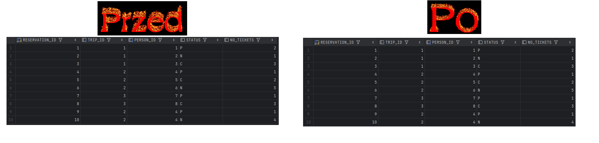


**2. Zmiana statusu rezerwacji i zapis do loga**

```sql
SET TRANSACTION READ WRITE;

UPDATE reservation SET status = 'P' WHERE reservation_id = 2;

INSERT INTO log (reservation_id, log_date, status, no_tickets)
    SELECT RESERVATION_ID, SYSDATE, STATUS, NO_TICKETS FROM RESERVATION WHERE RESERVATION_ID = 2;

COMMIT;
```
Zdjęcie pokazujące zmiany w bazie danych:

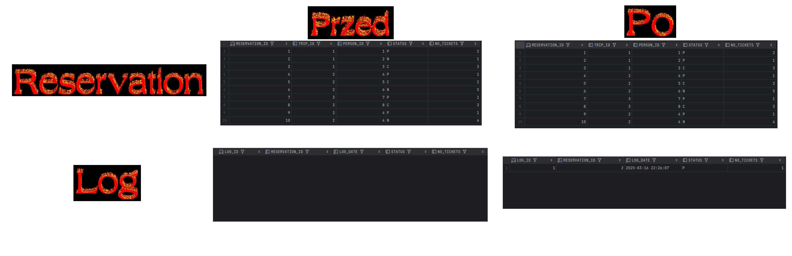


**3. Przykład wycofania transakcji w przypadku błędu (próba dodania więcej biletów niż dostępnych miejsc)**

```sql

SET TRANSACTION READ WRITE;

DECLARE
    v_max_places INT;
    v_reserved INT;
    v_number_of_tickets INT;

BEGIN
    v_number_of_tickets := 2;
    SELECT max_no_places INTO v_max_places FROM trip WHERE trip_id = 1;
    SELECT COALESCE(SUM(no_tickets), 0) INTO v_reserved FROM reservation WHERE trip_id = 1 AND status != 'C';

    IF v_reserved + v_number_of_tickets > v_max_places THEN
        ROLLBACK;
    ELSE
        INSERT INTO reservation (trip_id, person_id, status, no_tickets) VALUES (1, 5, 'N', v_number_of_tickets);
        COMMIT;
    END IF;
END;

```
Zdjęcie pokazujące zmiany w bazie danych:

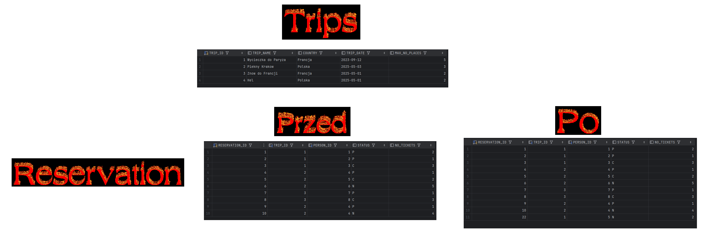
Wysoki indeks nowej rezerwacji spowodowany jest wcześniejszą próbą dodania przykładowych danych do tabeli, które się zdublowały niestety

### Transkacje - co i jak

&nbsp;&nbsp;&nbsp;&nbsp;Transakcja w bazie danych to zbiór operacji, które są wykonywane jako jedna, niepodzielna jednostka. Oznacza to, że wszystkie zmiany dokonane w ramach transakcji muszą zostać zatwierdzone (commit) lub wycofane (rollback) w przypadku błędu.

&nbsp;&nbsp;&nbsp;&nbsp;```COMMIT``` – zatwierdza wszystkie operacje wykonane w ramach transakcji, czyniąc zmiany trwałymi. Po wykonaniu COMMIT nie można już cofnąć zmian.
&nbsp;&nbsp;&nbsp;&nbsp;```ROLLBACK``` – cofa wszystkie operacje wykonane w bieżącej transakcji, przywracając stan bazy sprzed jej rozpoczęcia.

&nbsp;&nbsp;&nbsp;&nbsp;Jeśli w trakcie wykonywania transakcji wystąpi błąd wykonuje się automatyczne wycofanie (rollback). Możemy oczywiście założyć możliwość takiego błędu, złapać go i zrobić co chcemy wtedy.

&nbsp;&nbsp;&nbsp;&nbsp;*Oracle PL/SQL* oraz *MS Sqlserver T-SQL* mają podobne mechanizmy transakcyjne, ale różnią się składnią i sposobem zarządzania sesjami oraz błędami. Oracle domyślnie zaczyna transakcję automatycznie, podczas gdy w SQL Server trzeba ją jawnie rozpocząć.

---
# Zadanie 1 - widoki


Tworzenie widoków. Należy przygotować kilka widoków ułatwiających dostęp do danych. Należy zwrócić uwagę na strukturę kodu (należy unikać powielania kodu)

Widoki:
-   `vw_reservation`
	- widok łączy dane z tabel: `trip`,  `person`,  `reservation`
	- zwracane dane:  `reservation_id`,  `country`, `trip_date`, `trip_name`, `firstname`, `lastname`, `status`, `trip_id`, `person_id`, `no_tickets`
- `vw_trip` 
	- widok pokazuje liczbę wolnych miejsc na każdą wycieczkę
	- zwracane dane: `trip_id`, `country`, `trip_date`, `trip_name`, `max_no_places`, `no_available_places` (liczba wolnych miejsc)
-  `vw_available_trip`
	- podobnie jak w poprzednim punkcie, z tym że widok pokazuje jedynie dostępne wycieczki (takie które są w przyszłości i są na nie wolne miejsca)


Proponowany zestaw widoków można rozbudować wedle uznania/potrzeb
- np. można dodać nowe/pomocnicze widoki, funkcje
- np. można zmienić def. widoków, dodając nowe/potrzebne pola

# Zadanie 1  - rozwiązanie

**Dla ```vw_reservation```**:
```sql

create view vw_reservation
as
       SELECT reservation_id, country, trip_date, trip_name, firstname, lastname, status, t.trip_id, p.person_id, no_tickets
       FROM TRIP t
       JOIN RESERVATION r ON t.TRIP_ID = r.TRIP_ID
       JOIN PERSON p ON r.PERSON_ID = p.PERSON_ID
       ORDER BY reservation_id, t.trip_id;

commit;

```
A rezultatem uruchomienia tego widoku jest:

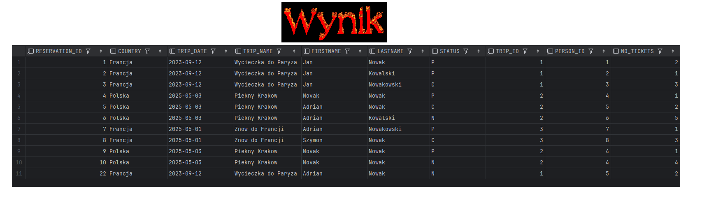

**Dla ```vw_trip```:**
```sql
create view vw_trip
as
    SELECT UNIQUE t.trip_id, country, trip_date, trip_name, max_no_places, (max_no_places - NVL(SUM(r.no_tickets), 0)) as no_available_places
    FROM trip t
    LEFT JOIN reservation r ON t.trip_id = r.trip_id AND status != 'C'
    GROUP BY t.trip_id, country, trip_date, trip_name, max_no_places, max_no_places;
    
commit;
```
A rezultatem uruchomienia tego widoku jest:

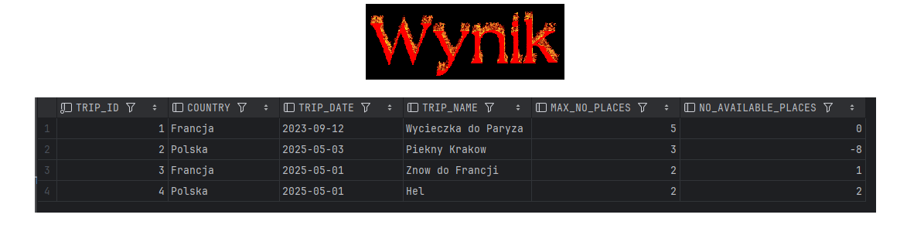

**Dla ```vw_available_trip```:**
```sql
create view vw_available_trip
as
    SELECT *
    FROM vw_trip
    WHERE no_available_places > 0;
    
commit;
```
A rezultatem uruchomienia tego widoku jest:

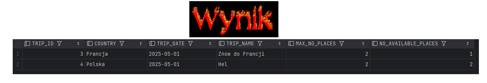

---
# Zadanie 2  - funkcje


Tworzenie funkcji pobierających dane/tabele. Podobnie jak w poprzednim przykładzie należy przygotować kilka funkcji ułatwiających dostęp do danych

Procedury:
- `f_trip_participants`
	- zadaniem funkcji jest zwrócenie listy uczestników wskazanej wycieczki
	- parametry funkcji: `trip_id`
	- funkcja zwraca podobny zestaw danych jak widok  `vw_eservation`
-  `f_person_reservations`
	- zadaniem funkcji jest zwrócenie listy rezerwacji danej osoby 
	- parametry funkcji: `person_id`
	- funkcja zwraca podobny zestaw danych jak widok `vw_reservation`
-  `f_available_trips_to`
	- zadaniem funkcji jest zwrócenie listy wycieczek do wskazanego kraju, dostępnych w zadanym okresie czasu (od `date_from` do `date_to`)
	- parametry funkcji: `country`, `date_from`, `date_to`


Funkcje powinny zwracać tabelę/zbiór wynikowy. Należy rozważyć dodanie kontroli parametrów, (np. jeśli parametrem jest `trip_id` to można sprawdzić czy taka wycieczka istnieje). Podobnie jak w przypadku widoków należy zwrócić uwagę na strukturę kodu

Czy kontrola parametrów w przypadku funkcji ma sens?
- jakie są zalety/wady takiego rozwiązania?

Proponowany zestaw funkcji można rozbudować wedle uznania/potrzeb
- np. można dodać nowe/pomocnicze funkcje/procedury

# Zadanie 2  - rozwiązanie

**f_trip_participants**

```sql

create or replace function f_trip_participants(trip_id int)
    return persons_on_trip_table
as
    result persons_on_trip_table;
begin

    SELECT person_on_trip(res.firstname, res.lastname)
    bulk collect
    into result
    from vw_reservation res
    where res.trip_id = f_trip_participants.trip_id and res.status != 'C';

    return result;
end;
/

```
A rezultatem uruchomienia tej funkcji dla trip_id = 1 jest:

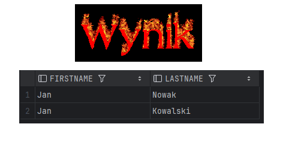

**f_person_reservations**

```sql

create or replace function f_person_reservations(person_id int)
    return trips_table
as
    result trips_table;
begin

    SELECT trip_object(res.TRIP_ID, res.TRIP_NAME)
    bulk collect
    into result
    from vw_reservation res
    where res.PERSON_ID = f_person_reservations.person_id and res.status != 'C';

    return result;
end;
/

```

A rezultatem uruchomienia tej funkcji dla person_id = 1 jest:

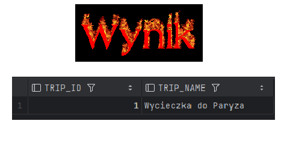

**f_available_trips_to**

```sql

create or replace function f_available_trips_to(country varchar2, date_from date, date_to date)
    return trips_table
as
    result trips_table;
begin

    SELECT trip_object(avt.TRIP_ID, avt.TRIP_NAME)
    bulk collect
    into result
    from vw_available_trip avt
    where (avt.COUNTRY = f_available_trips_to.country) and (avt.TRIP_DATE BETWEEN f_available_trips_to.date_from and f_available_trips_to.date_to);

    return result;
end;
/

```

A rezultatem uruchomienia tej funkcji dla country = 'Polska', date_from = 01-01-2025, date_to = 01-01-2026 jest:

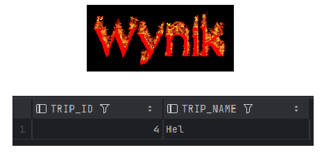
---
# Zadanie 3  - procedury


Tworzenie procedur modyfikujących dane. Należy przygotować zestaw procedur pozwalających na modyfikację danych oraz kontrolę poprawności ich wprowadzania

Procedury
- `p_add_reservation`
	- zadaniem procedury jest dopisanie nowej rezerwacji
	- parametry: `trip_id`, `person_id`,  `no_tickets`
	- procedura powinna kontrolować czy wycieczka jeszcze się nie odbyła, i czy sa wolne miejsca
	- procedura powinna również dopisywać inf. do tabeli `log`
- `p_modify_reservation_status
	- zadaniem procedury jest zmiana statusu rezerwacji 
	- parametry: `reservation_id`, `status`
	- procedura powinna kontrolować czy możliwa jest zmiana statusu, np. zmiana statusu już anulowanej wycieczki (przywrócenie do stanu aktywnego nie zawsze jest możliwa – może już nie być miejsc)
	- procedura powinna również dopisywać inf. do tabeli `log`
- `p_modify_reservation
	- zadaniem procedury jest zmiana statusu rezerwacji 
	- parametry: `reservation_id`, `no_iickets`
	- procedura powinna kontrolować czy możliwa jest zmiana liczby sprzedanych/zarezerwowanych biletów – może już nie być miejsc
	- procedura powinna również dopisywać inf. do tabeli `log`
- `p_modify_max_no_places`
	- zadaniem procedury jest zmiana maksymalnej liczby miejsc na daną wycieczkę 
	- parametry: `trip_id`, `max_no_places`
	- nie wszystkie zmiany liczby miejsc są dozwolone, nie można zmniejszyć liczby miejsc na wartość poniżej liczby zarezerwowanych miejsc

Należy rozważyć użycie transakcji

Należy zwrócić uwagę na kontrolę parametrów (np. jeśli parametrem jest trip_id to należy sprawdzić czy taka wycieczka istnieje, jeśli robimy rezerwację to należy sprawdzać czy są wolne miejsca itp..)


Proponowany zestaw procedur można rozbudować wedle uznania/potrzeb
- np. można dodać nowe/pomocnicze funkcje/procedury

# Zadanie 3  - rozwiązanie

**p_add_reservation**

```sql

create PROCEDURE p_add_reservation(
    p_trip_id IN trip.trip_id%TYPE,
    p_person_id IN person.person_id%TYPE,
    p_no_tickets IN reservation.no_tickets%TYPE
) AS
    v_trip_date trip.trip_date%TYPE;
    v_max_places trip.max_no_places%TYPE;
    v_reserved NUMBER;
    v_available NUMBER;
    v_trip_exists NUMBER;
    v_person_exists NUMBER;
    e_past_trip EXCEPTION;
    e_no_available_places EXCEPTION;
    e_trip_not_exists EXCEPTION;
    e_person_not_exists EXCEPTION;
BEGIN
    -- Sprawdzenie czy wycieczka istnieje
    SELECT COUNT(*) INTO v_trip_exists FROM trip WHERE trip_id = p_trip_id;
    IF v_trip_exists = 0 THEN
        RAISE e_trip_not_exists;
    END IF;

    -- Sprawdzenie czy osoba istnieje
    SELECT COUNT(*) INTO v_person_exists FROM person WHERE person_id = p_person_id;
    IF v_person_exists = 0 THEN
        RAISE e_person_not_exists;
    END IF;

    -- Pobranie daty wycieczki i maksymalnej liczby miejsc
    SELECT trip_date, max_no_places INTO v_trip_date, v_max_places
    FROM trip
    WHERE trip_id = p_trip_id;

    -- Sprawdzenie czy wycieczka się już nie odbyła
    IF v_trip_date < SYSDATE THEN
        RAISE e_past_trip;
    END IF;

    -- Obliczenie zajętych miejsc (tylko rezerwacje ze statusem N lub P)
    SELECT NVL(SUM(no_tickets), 0) INTO v_reserved
    FROM reservation
    WHERE trip_id = p_trip_id AND status IN ('N', 'P');

    -- Obliczenie dostępnych miejsc
    v_available := v_max_places - v_reserved;

    -- Sprawdzenie czy są dostępne miejsca
    IF p_no_tickets > v_available THEN
        RAISE e_no_available_places;
    END IF;

    -- Dodanie rezerwacji
    INSERT INTO reservation(trip_id, person_id, status, no_tickets)
    VALUES(p_trip_id, p_person_id, 'N', p_no_tickets);

    -- Dodanie wpisu do logu
    INSERT INTO log(reservation_id, log_date, status, no_tickets)
    VALUES(s_reservation_seq.currval, SYSDATE, 'N', p_no_tickets);

    -- Zatwierdzenie transakcji
    COMMIT;

EXCEPTION
    WHEN e_past_trip THEN
        ROLLBACK;
        RAISE_APPLICATION_ERROR(-20001, 'Nie można zarezerwować wycieczki, która już się odbyła.');
    WHEN e_no_available_places THEN
        ROLLBACK;
        RAISE_APPLICATION_ERROR(-20002, 'Nie ma wystarczającej liczby wolnych miejsc na wycieczce.');
    WHEN e_trip_not_exists THEN
        ROLLBACK;
        RAISE_APPLICATION_ERROR(-20003, 'Wycieczka o podanym ID nie istnieje.');
    WHEN e_person_not_exists THEN
        ROLLBACK;
        RAISE_APPLICATION_ERROR(-20004, 'Osoba o podanym ID nie istnieje.');
    WHEN OTHERS THEN
        ROLLBACK;
        RAISE_APPLICATION_ERROR(-20000, 'Wystąpił błąd: ' || SQLERRM);
END p_add_reservation;
/

```

Dodanie rezerwacji na wycieczkę o id = 3 przez osobę o id = 1 na 1 bilet skutkuje:

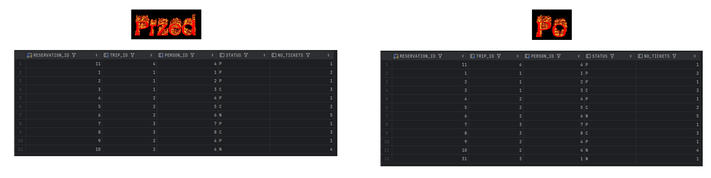


**p_modify_reservation_status**

```sql

create PROCEDURE p_modify_reservation_status(
    p_reservation_id IN reservation.reservation_id%TYPE,
    p_status IN reservation.status%TYPE
) AS
    v_old_status reservation.status%TYPE;
    v_trip_id reservation.trip_id%TYPE;
    v_trip_date trip.trip_date%TYPE;
    v_max_places trip.max_no_places%TYPE;
    v_no_tickets reservation.no_tickets%TYPE;
    v_reserved NUMBER;
    v_available NUMBER;
    v_reservation_exists NUMBER;
    e_reservation_not_exists EXCEPTION;
    e_invalid_status EXCEPTION;
    e_no_available_places EXCEPTION;
    e_past_trip EXCEPTION;
BEGIN
    -- Sprawdzenie czy rezerwacja istnieje
    SELECT COUNT(*) INTO v_reservation_exists FROM reservation WHERE reservation_id = p_reservation_id;
    IF v_reservation_exists = 0 THEN
        RAISE e_reservation_not_exists;
    END IF;
    
    -- Pobranie aktualnego statusu i liczby biletów w rezerwacji
    SELECT status, trip_id, no_tickets 
    INTO v_old_status, v_trip_id, v_no_tickets
    FROM reservation
    WHERE reservation_id = p_reservation_id;
    
    -- Nie można zmienić statusu na ten sam
    IF v_old_status = p_status THEN
        RETURN;
    END IF;
    
    -- Pobranie daty wycieczki i maksymalnej liczby miejsc
    SELECT trip_date, max_no_places INTO v_trip_date, v_max_places
    FROM trip
    WHERE trip_id = v_trip_id;
    
    -- Jeśli zmieniamy status z anulowanego (C) na nowy (N) lub potwierdzony (P)
    -- lub z potwierdzonego (P) na nowy (N)
    IF (v_old_status = 'C' AND p_status IN ('N', 'P')) OR
       (v_old_status = 'P' AND p_status = 'N') THEN
        
        -- Sprawdzenie czy wycieczka się już nie odbyła
        IF v_trip_date < SYSDATE THEN
            RAISE e_past_trip;
        END IF;
        
        -- Obliczenie zajętych miejsc (tylko rezerwacje ze statusem N lub P)
        SELECT NVL(SUM(no_tickets), 0) INTO v_reserved
        FROM reservation
        WHERE trip_id = v_trip_id AND status IN ('N', 'P') AND reservation_id != p_reservation_id;
        
        -- Obliczenie dostępnych miejsc
        v_available := v_max_places - v_reserved;
        
        -- Sprawdzenie czy są dostępne miejsca
        IF v_no_tickets > v_available THEN
            RAISE e_no_available_places;
        END IF;
    END IF;
    
    -- Aktualizacja statusu rezerwacji
    UPDATE reservation
    SET status = p_status
    WHERE reservation_id = p_reservation_id;
    
    -- Dodanie wpisu do logu
    INSERT INTO log(reservation_id, log_date, status, no_tickets)
    VALUES(p_reservation_id, SYSDATE, p_status, v_no_tickets);
    
    -- Zatwierdzenie transakcji
    COMMIT;
    
EXCEPTION
    WHEN e_reservation_not_exists THEN
        ROLLBACK;
        RAISE_APPLICATION_ERROR(-20005, 'Rezerwacja o podanym ID nie istnieje.');
    WHEN e_invalid_status THEN
        ROLLBACK;
        RAISE_APPLICATION_ERROR(-20006, 'Nieprawidłowy status rezerwacji.');
    WHEN e_no_available_places THEN
        ROLLBACK;
        RAISE_APPLICATION_ERROR(-20002, 'Nie ma wystarczającej liczby wolnych miejsc na wycieczce.');
    WHEN e_past_trip THEN
        ROLLBACK;
        RAISE_APPLICATION_ERROR(-20001, 'Nie można zmienić statusu dla wycieczki, która już się odbyła.');
    WHEN OTHERS THEN
        ROLLBACK;
        RAISE_APPLICATION_ERROR(-20000, 'Wystąpił błąd: ' || SQLERRM);
END p_modify_reservation_status;
/

```

Procedura wykonana z id rezerwacji = 31 i statusem = 'P':

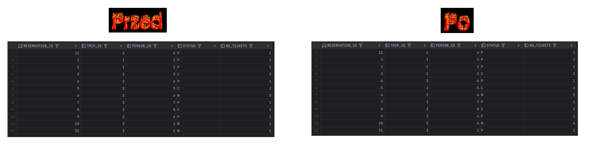


**p_modify_reservation**

```sql

create PROCEDURE p_modify_reservation(
    p_reservation_id IN reservation.reservation_id%TYPE,
    p_no_tickets IN reservation.no_tickets%TYPE
) AS
    v_old_tickets reservation.no_tickets%TYPE;
    v_status reservation.status%TYPE;
    v_trip_id reservation.trip_id%TYPE;
    v_trip_date trip.trip_date%TYPE;
    v_max_places trip.max_no_places%TYPE;
    v_reserved NUMBER;
    v_available NUMBER;
    v_reservation_exists NUMBER;
    e_reservation_not_exists EXCEPTION;
    e_no_available_places EXCEPTION;
    e_past_trip EXCEPTION;
    e_canceled_reservation EXCEPTION;
BEGIN
    -- Sprawdzenie czy rezerwacja istnieje
    SELECT COUNT(*) INTO v_reservation_exists FROM reservation WHERE reservation_id = p_reservation_id;
    IF v_reservation_exists = 0 THEN
        RAISE e_reservation_not_exists;
    END IF;

    -- Pobranie aktualnego statusu, liczby biletów i ID wycieczki
    SELECT status, no_tickets, trip_id
    INTO v_status, v_old_tickets, v_trip_id
    FROM reservation
    WHERE reservation_id = p_reservation_id;

    -- Nie można modyfikować anulowanej rezerwacji
    IF v_status = 'C' THEN
        RAISE e_canceled_reservation;
    END IF;

    -- Jeśli liczba biletów się nie zmienia
    IF v_old_tickets = p_no_tickets THEN
        RETURN;
    END IF;

    -- Pobranie daty wycieczki i maksymalnej liczby miejsc
    SELECT trip_date, max_no_places INTO v_trip_date, v_max_places
    FROM trip
    WHERE trip_id = v_trip_id;

    -- Sprawdzenie czy wycieczka się już nie odbyła
    IF v_trip_date < SYSDATE THEN
        RAISE e_past_trip;
    END IF;

    -- Jeśli zwiększamy liczbę biletów
    IF p_no_tickets > v_old_tickets THEN
        -- Obliczenie zajętych miejsc (tylko rezerwacje ze statusem N lub P)
        SELECT NVL(SUM(no_tickets), 0) INTO v_reserved
        FROM reservation
        WHERE trip_id = v_trip_id AND status IN ('N', 'P') AND reservation_id != p_reservation_id;

        -- Obliczenie dostępnych miejsc
        v_available := v_max_places - v_reserved;

        -- Sprawdzenie czy są dostępne miejsca
        IF (p_no_tickets - v_old_tickets) > v_available THEN
            RAISE e_no_available_places;
        END IF;
    END IF;

    -- Aktualizacja liczby biletów
    UPDATE reservation
    SET no_tickets = p_no_tickets
    WHERE reservation_id = p_reservation_id;

    -- Dodanie wpisu do logu
    INSERT INTO log(reservation_id, log_date, status, no_tickets)
    VALUES(p_reservation_id, SYSDATE, v_status, p_no_tickets);

    -- Zatwierdzenie transakcji
    COMMIT;

EXCEPTION
    WHEN e_reservation_not_exists THEN
        ROLLBACK;
        RAISE_APPLICATION_ERROR(-20005, 'Rezerwacja o podanym ID nie istnieje.');
    WHEN e_no_available_places THEN
        ROLLBACK;
        RAISE_APPLICATION_ERROR(-20002, 'Nie ma wystarczającej liczby wolnych miejsc na wycieczce.');
    WHEN e_past_trip THEN
        ROLLBACK;
        RAISE_APPLICATION_ERROR(-20001, 'Nie można modyfikować rezerwacji dla wycieczki, która już się odbyła.');
    WHEN e_canceled_reservation THEN
        ROLLBACK;
        RAISE_APPLICATION_ERROR(-20007, 'Nie można modyfikować anulowanej rezerwacji.');
    WHEN OTHERS THEN
        ROLLBACK;
        RAISE_APPLICATION_ERROR(-20000, 'Wystąpił błąd: ' || SQLERRM);
END p_modify_reservation;
/

```

Procedura wykonana z id rezerwacji = 31 i numerem biletów = 2:

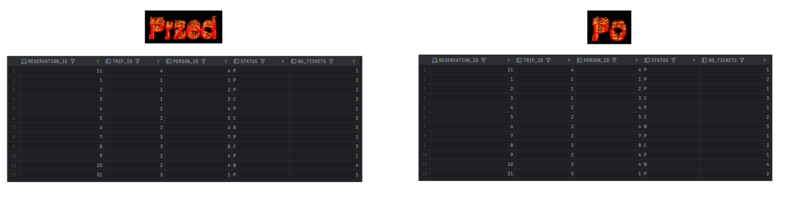


**p_modify_max_no_places**

```sql

create PROCEDURE p_modify_max_no_places(
    p_trip_id IN trip.trip_id%TYPE,
    p_max_no_places IN trip.max_no_places%TYPE
) AS
    v_reserved NUMBER;
    v_trip_exists NUMBER;
    e_trip_not_exists EXCEPTION;
    e_invalid_places EXCEPTION;
BEGIN
    -- Sprawdzenie czy wycieczka istnieje
    SELECT COUNT(*) INTO v_trip_exists FROM trip WHERE trip_id = p_trip_id;
    IF v_trip_exists = 0 THEN
        RAISE e_trip_not_exists;
    END IF;

    -- Obliczenie zajętych miejsc (tylko rezerwacje ze statusem N lub P)
    SELECT NVL(SUM(no_tickets), 0) INTO v_reserved
    FROM reservation
    WHERE trip_id = p_trip_id AND status IN ('N', 'P');

    -- Sprawdzenie czy nowa liczba miejsc nie jest mniejsza od liczby zarezerwowanych miejsc
    IF p_max_no_places < v_reserved THEN
        RAISE e_invalid_places;
    END IF;

    -- Aktualizacja maksymalnej liczby miejsc
    UPDATE trip
    SET max_no_places = p_max_no_places
    WHERE trip_id = p_trip_id;

    -- Zatwierdzenie transakcji
    COMMIT;

EXCEPTION
    WHEN e_trip_not_exists THEN
        ROLLBACK;
        RAISE_APPLICATION_ERROR(-20003, 'Wycieczka o podanym ID nie istnieje.');
    WHEN e_invalid_places THEN
        ROLLBACK;
        RAISE_APPLICATION_ERROR(-20008, 'Nie można zmniejszyć liczby miejsc poniżej liczby już zarezerwowanych miejsc.');
    WHEN OTHERS THEN
        ROLLBACK;
        RAISE_APPLICATION_ERROR(-20000, 'Wystąpił błąd: ' || SQLERRM);
END p_modify_max_no_places;
/

```

Procedura wykonana z id wycieczki = 3 i liczbą miejsc = 15:

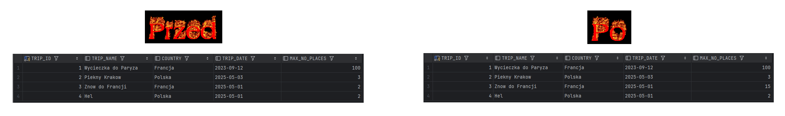
---
# Zadanie 4  - triggery


Zmiana strategii zapisywania do dziennika rezerwacji. Realizacja przy pomocy triggerów

Należy wprowadzić zmianę, która spowoduje, że zapis do dziennika będzie realizowany przy pomocy trigerów

Triggery:
- trigger/triggery obsługujące 
	- dodanie rezerwacji
	- zmianę statusu
	- zmianę liczby zarezerwowanych/kupionych biletów
- trigger zabraniający usunięcia rezerwacji

Oczywiście po wprowadzeniu tej zmiany należy "uaktualnić" procedury modyfikujące dane. 

>UWAGA
Należy stworzyć nowe wersje tych procedur (dodając do nazwy dopisek 4 - od numeru zadania). Poprzednie wersje procedur należy pozostawić w celu  umożliwienia weryfikacji ich poprawności

Należy przygotować procedury: `p_add_reservation_4`, `p_modify_reservation_status_4` , `p_modify_reservation_4`


# Zadanie 4  - rozwiązanie

Triggery wykonujące zadane polecenia:

**trg_add_reservation**

```sql
-- Trigger obsługujący dodanie nowej rezerwacji
CREATE OR REPLACE TRIGGER trg_add_reservation
AFTER INSERT ON reservation
FOR EACH ROW
BEGIN
-- Dodanie wpisu do dziennika
INSERT INTO log(reservation_id, log_date, status, no_tickets)
VALUES (:new.reservation_id, SYSDATE, :new.status, :new.no_tickets);
END;
/
```

**trg_modify_reservation_status**

```sql
-- Trigger obsługujący zmianę statusu rezerwacji
CREATE OR REPLACE TRIGGER trg_modify_reservation_status
AFTER UPDATE OF status ON reservation
FOR EACH ROW
BEGIN
-- Dodanie wpisu do dziennika po zmianie statusu
INSERT INTO log(reservation_id, log_date, status, no_tickets)
VALUES (:new.reservation_id, SYSDATE, :new.status, :new.no_tickets);
END;
/
```

**trg_modify_reservation_tickets**

```sql
-- Trigger obsługujący zmianę liczby biletów
CREATE OR REPLACE TRIGGER trg_modify_reservation_tickets
AFTER UPDATE OF no_tickets ON reservation
FOR EACH ROW
WHEN (OLD.no_tickets != NEW.no_tickets)
BEGIN
-- Dodanie wpisu do dziennika po zmianie liczby biletów
INSERT INTO log(reservation_id, log_date, status, no_tickets)
VALUES (:new.reservation_id, SYSDATE, :new.status, :new.no_tickets);
END;
/
```

**trg_prevent_reservation_delete**

```sql
-- Trigger zabraniający usunięcia rezerwacji
CREATE OR REPLACE TRIGGER trg_prevent_reservation_delete
BEFORE DELETE ON reservation
FOR EACH ROW
BEGIN
-- Zgłoszenie błędu zabraniającego usunięcia
RAISE_APPLICATION_ERROR(-20001, 'Usuwanie rezerwacji jest zabronione.');
END;
/
```

Zmodyfikowane procedury:

**p_add_reservation_4**

```sql
create PROCEDURE p_add_reservation_4(
p_trip_id IN trip.trip_id%TYPE,
p_person_id IN person.person_id%TYPE,
p_no_tickets IN reservation.no_tickets%TYPE
)
AS
v_trip_date trip.trip_date%TYPE;
v_max_places trip.max_no_places%TYPE;
v_reserved_places NUMBER;
v_available_places NUMBER;
BEGIN
-- Sprawdzenie czy wycieczka istnieje
SELECT trip_date, max_no_places
INTO v_trip_date, v_max_places
FROM trip
WHERE trip_id = p_trip_id;

-- Sprawdzenie czy wycieczka już się nie odbyła
IF v_trip_date < SYSDATE THEN
RAISE_APPLICATION_ERROR(-20002, 'Nie można zarezerwować miejsca na wycieczkę, która już się odbyła.');
END IF;

-- Obliczenie liczby zarezerwowanych miejsc
SELECT NVL(SUM(no_tickets), 0)
INTO v_reserved_places
FROM reservation
WHERE trip_id = p_trip_id
AND status IN ('N', 'P'); -- tylko aktywne rezerwacje (nowe i opłacone)

-- Obliczenie dostępnych miejsc
v_available_places := v_max_places - v_reserved_places;

-- Sprawdzenie czy są dostępne miejsca
IF v_available_places < p_no_tickets THEN
RAISE_APPLICATION_ERROR(-20003, 'Brak wystarczającej liczby miejsc na wycieczce.');
END IF;

-- Dodanie rezerwacji
INSERT INTO reservation(trip_id, person_id, status, no_tickets)
VALUES (p_trip_id, p_person_id, 'N', p_no_tickets);

-- Nie musimy już jawnie dodawać wpisu do dziennika, zajmie się tym trigger

COMMIT;
EXCEPTION
WHEN NO_DATA_FOUND THEN
RAISE_APPLICATION_ERROR(-20004, 'Nie znaleziono wycieczki o podanym ID.');
WHEN OTHERS THEN
ROLLBACK;
RAISE;
END;
/
```

**p_modify_reservation_4**

```sql
create PROCEDURE p_modify_reservation_4(
p_reservation_id IN reservation.reservation_id%TYPE,
p_no_tickets IN reservation.no_tickets%TYPE
)
AS
v_current_tickets reservation.no_tickets%TYPE;
v_status reservation.status%TYPE;
v_trip_id trip.trip_id%TYPE;
v_max_places trip.max_no_places%TYPE;
v_reserved_places NUMBER;
v_available_places NUMBER;
v_ticket_diff NUMBER;
BEGIN
-- Pobranie informacji o rezerwacji
SELECT r.no_tickets, r.status, r.trip_id, t.max_no_places
INTO v_current_tickets, v_status, v_trip_id, v_max_places
FROM reservation r
JOIN trip t ON r.trip_id = t.trip_id
WHERE r.reservation_id = p_reservation_id;

-- Sprawdzenie czy rezerwacja nie jest anulowana
IF v_status = 'C' THEN
RAISE_APPLICATION_ERROR(-20006, 'Nie można modyfikować anulowanej rezerwacji.');
END IF;

-- Obliczenie różnicy w liczbie biletów
v_ticket_diff := p_no_tickets - v_current_tickets;

-- Jeśli zwiększamy liczbę biletów, musimy sprawdzić dostępność miejsc
IF v_ticket_diff > 0 THEN
-- Obliczenie liczby zarezerwowanych miejsc
SELECT NVL(SUM(no_tickets), 0)
INTO v_reserved_places
FROM reservation
WHERE trip_id = v_trip_id
AND status IN ('N', 'P')
AND reservation_id != p_reservation_id; -- nie licząc modyfikowanej rezerwacji

-- Obliczenie dostępnych miejsc
v_available_places := v_max_places - v_reserved_places - v_current_tickets;

-- Sprawdzenie czy są dostępne miejsca
IF v_available_places < v_ticket_diff THEN
RAISE_APPLICATION_ERROR(-20003, 'Brak wystarczającej liczby miejsc na wycieczce.');
END IF;
END IF;

-- Aktualizacja liczby biletów
UPDATE reservation
SET no_tickets = p_no_tickets
WHERE reservation_id = p_reservation_id;

-- Nie musimy już jawnie dodawać wpisu do dziennika, zajmie się tym trigger

COMMIT;
EXCEPTION
WHEN NO_DATA_FOUND THEN
RAISE_APPLICATION_ERROR(-20005, 'Nie znaleziono rezerwacji o podanym ID.');
WHEN OTHERS THEN
ROLLBACK;
RAISE;
END;
/
```

**p_modify_reservation_status_4**

```sql
create PROCEDURE p_modify_reservation_status_4(
p_reservation_id IN reservation.reservation_id%TYPE,
p_status IN reservation.status%TYPE
)
AS
v_current_status reservation.status%TYPE;
v_trip_id trip.trip_id%TYPE;
v_trip_date trip.trip_date%TYPE;
v_max_places trip.max_no_places%TYPE;
v_reserved_places NUMBER;
v_available_places NUMBER;
v_no_tickets reservation.no_tickets%TYPE;
BEGIN
-- Pobranie informacji o rezerwacji
SELECT r.status, r.trip_id, r.no_tickets, t.trip_date, t.max_no_places
INTO v_current_status, v_trip_id, v_no_tickets, v_trip_date, v_max_places
FROM reservation r
JOIN trip t ON r.trip_id = t.trip_id
WHERE r.reservation_id = p_reservation_id;

-- Sprawdzenie czy można zmienić status
IF v_current_status = 'C' AND p_status IN ('N', 'P') THEN
-- Próba przywrócenia anulowanej rezerwacji - musimy sprawdzić dostępność miejsc

-- Obliczenie liczby zarezerwowanych miejsc
SELECT NVL(SUM(no_tickets), 0)
INTO v_reserved_places
FROM reservation
WHERE trip_id = v_trip_id
AND status IN ('N', 'P')
AND reservation_id != p_reservation_id; -- nie licząc modyfikowanej rezerwacji

-- Obliczenie dostępnych miejsc
v_available_places := v_max_places - v_reserved_places;

-- Sprawdzenie czy są dostępne miejsca
IF v_available_places < v_no_tickets THEN
RAISE_APPLICATION_ERROR(-20003, 'Brak wystarczającej liczby miejsc na wycieczce.');
END IF;
END IF;

-- Aktualizacja statusu rezerwacji
UPDATE reservation
SET status = p_status
WHERE reservation_id = p_reservation_id;

-- Nie musimy już jawnie dodawać wpisu do dziennika, zajmie się tym trigger

COMMIT;
EXCEPTION
WHEN NO_DATA_FOUND THEN
RAISE_APPLICATION_ERROR(-20005, 'Nie znaleziono rezerwacji o podanym ID.');
WHEN OTHERS THEN
ROLLBACK;
RAISE;
END;
/
```

Gdy próbujemy usunąć rekord w rezerwacjach dostajemy błąd:


Dodanie rezerwacji na wycieczkę o id = 3, przez osobę o id = 5 oraz liczbą biletów = 5:
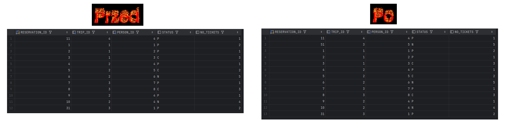

Modyfikacja statusu rezerwacji id = 51 na status = 'P':
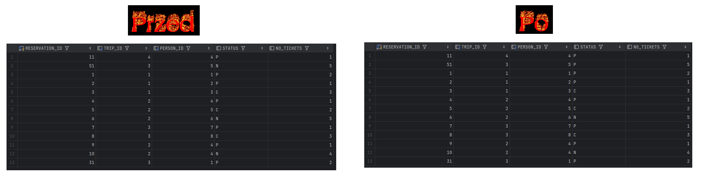

Modyfikacja liczby biletów na = 2 dla rezerwacji id = 51:
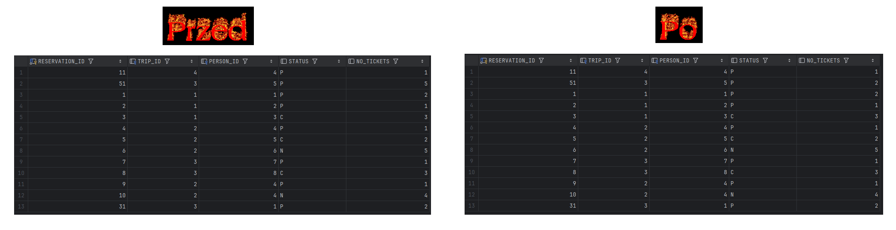

---
# Zadanie 5  - triggery


Zmiana strategii kontroli dostępności miejsc. Realizacja przy pomocy triggerów

Należy wprowadzić zmianę, która spowoduje, że kontrola dostępności miejsc na wycieczki (przy dodawaniu nowej rezerwacji, zmianie statusu) będzie realizowana przy pomocy trigerów

Triggery:
- Trigger/triggery obsługujące: 
	- dodanie rezerwacji
	- zmianę statusu
	- zmianę liczby zakupionych/zarezerwowanych miejsc/biletów

Oczywiście po wprowadzeniu tej zmiany należy "uaktualnić" procedury modyfikujące dane. 

>UWAGA
Należy stworzyć nowe wersje tych procedur (np. dodając do nazwy dopisek 5 - od numeru zadania). Poprzednie wersje procedur należy pozostawić w celu  umożliwienia weryfikacji ich poprawności. 

Należy przygotować procedury: `p_add_reservation_5`, `p_modify_reservation_status_5`, `p_modify_reservation_status_5`


# Zadanie 5  - rozwiązanie

Triggerry:

**trg_check_available_places_insert**

```sql
CREATE OR REPLACE TRIGGER trg_check_available_places_insert
BEFORE INSERT ON reservation
FOR EACH ROW
DECLARE
v_trip_date trip.trip_date%TYPE;
v_max_places trip.max_no_places%TYPE;
v_reserved_places NUMBER;
v_available_places NUMBER;
BEGIN
-- Pobranie informacji o wycieczce
SELECT trip_date, max_no_places
INTO v_trip_date, v_max_places
FROM trip
WHERE trip_id = :new.trip_id;

-- Sprawdzenie czy wycieczka już się nie odbyła
IF v_trip_date < SYSDATE THEN
RAISE_APPLICATION_ERROR(-20002, 'Nie można zarezerwować miejsca na wycieczkę, która już się odbyła.');
END IF;

-- Jeśli rezerwacja jest aktywna (status N lub P), sprawdzamy dostępność miejsc
IF :new.status IN ('N', 'P') THEN
-- Obliczenie liczby zarezerwowanych miejsc
SELECT NVL(SUM(no_tickets), 0)
INTO v_reserved_places
FROM reservation
WHERE trip_id = :new.trip_id
AND status IN ('N', 'P');

-- Obliczenie dostępnych miejsc
v_available_places := v_max_places - v_reserved_places;

-- Sprawdzenie czy są dostępne miejsca
IF v_available_places < :new.no_tickets THEN
RAISE_APPLICATION_ERROR(-20003, 'Brak wystarczającej liczby miejsc na wycieczce.');
END IF;
END IF;
EXCEPTION
WHEN NO_DATA_FOUND THEN
RAISE_APPLICATION_ERROR(-20004, 'Nie znaleziono wycieczki o podanym ID.');
END;
/
```

**trg_check_available_places_update**

```sql
-- Trigger do kontroli dostępności miejsc przy zmianie statusu lub liczby biletów
CREATE OR REPLACE TRIGGER trg_check_available_places_update
BEFORE UPDATE OF status, no_tickets ON reservation
FOR EACH ROW
DECLARE
v_trip_date trip.trip_date%TYPE;
v_max_places trip.max_no_places%TYPE;
v_reserved_places NUMBER;
v_available_places NUMBER;
v_ticket_diff NUMBER := 0;
BEGIN
-- Pobranie informacji o wycieczce
SELECT trip_date, max_no_places
INTO v_trip_date, v_max_places
FROM trip
WHERE trip_id = :new.trip_id;

-- Jeśli zmieniamy status z anulowanego (C) na aktywny (N lub P)
IF :old.status = 'C' AND :new.status IN ('N', 'P') THEN
-- Obliczenie liczby zarezerwowanych miejsc (bez uwzględniania tej rezerwacji)
SELECT NVL(SUM(no_tickets), 0)
INTO v_reserved_places
FROM reservation
WHERE trip_id = :new.trip_id
AND status IN ('N', 'P')
AND reservation_id != :new.reservation_id;

-- Obliczenie dostępnych miejsc
v_available_places := v_max_places - v_reserved_places;

-- Sprawdzenie czy są dostępne miejsca
IF v_available_places < :new.no_tickets THEN
RAISE_APPLICATION_ERROR(-20003, 'Brak wystarczającej liczby miejsc na wycieczce.');
END IF;
END IF;

-- Jeśli zmieniamy liczbę biletów i rezerwacja jest aktywna
IF :old.no_tickets != :new.no_tickets AND :new.status IN ('N', 'P') THEN
-- Obliczenie różnicy w liczbie biletów
v_ticket_diff := :new.no_tickets - :old.no_tickets;

-- Jeśli zwiększamy liczbę biletów
IF v_ticket_diff > 0 THEN
-- Obliczenie liczby zarezerwowanych miejsc (bez uwzględniania tej rezerwacji)
SELECT NVL(SUM(no_tickets), 0)
INTO v_reserved_places
FROM reservation
WHERE trip_id = :new.trip_id
AND status IN ('N', 'P')
AND reservation_id != :new.reservation_id;

-- Obliczenie dostępnych miejsc
v_available_places := v_max_places - v_reserved_places - :old.no_tickets;

-- Sprawdzenie czy są dostępne miejsca
IF v_available_places < v_ticket_diff THEN
RAISE_APPLICATION_ERROR(-20003, 'Brak wystarczającej liczby miejsc na wycieczce.');
END IF;
END IF;
END IF;
EXCEPTION
WHEN NO_DATA_FOUND THEN
RAISE_APPLICATION_ERROR(-20004, 'Nie znaleziono wycieczki o podanym ID.');
END;
/
```

**p_add_reservation_5**

```sql
-- Zmodyfikowana procedura dodawania rezerwacji (wersja 5)
CREATE OR REPLACE PROCEDURE p_add_reservation_5(
p_trip_id IN trip.trip_id%TYPE,
p_person_id IN person.person_id%TYPE,
p_no_tickets IN reservation.no_tickets%TYPE
)
AS
BEGIN
-- Sprawdzenie czy osoba istnieje
DECLARE
v_person_exists NUMBER;
BEGIN
SELECT COUNT(*)
INTO v_person_exists
FROM person
WHERE person_id = p_person_id;

IF v_person_exists = 0 THEN
RAISE_APPLICATION_ERROR(-20007, 'Nie znaleziono osoby o podanym ID.');
END IF;
END;

-- Dodanie rezerwacji - kontrolę dostępności miejsc obsługuje trigger
INSERT INTO reservation(trip_id, person_id, status, no_tickets)
VALUES (p_trip_id, p_person_id, 'N', p_no_tickets);

COMMIT;
EXCEPTION
WHEN OTHERS THEN
ROLLBACK;
RAISE;
END;
/
```
```sql
-- Zmodyfikowana procedura zmiany statusu rezerwacji (wersja 5)
CREATE OR REPLACE PROCEDURE p_modify_reservation_status_5(
p_reservation_id IN reservation.reservation_id%TYPE,
p_status IN reservation.status%TYPE
)
AS
v_exists NUMBER;
BEGIN
-- Sprawdzenie czy rezerwacja istnieje
SELECT COUNT(*)
INTO v_exists
FROM reservation
WHERE reservation_id = p_reservation_id;

IF v_exists = 0 THEN
RAISE_APPLICATION_ERROR(-20005, 'Nie znaleziono rezerwacji o podanym ID.');
END IF;

-- Aktualizacja statusu rezerwacji - kontrolę dostępności miejsc obsługuje trigger
UPDATE reservation
SET status = p_status
WHERE reservation_id = p_reservation_id;

COMMIT;
EXCEPTION
WHEN OTHERS THEN
ROLLBACK;
RAISE;
END;
/
```

**p_modify_reservation_5**

```sql
-- Zmodyfikowana procedura zmiany liczby biletów (wersja 5)
CREATE OR REPLACE PROCEDURE p_modify_reservation_5(
p_reservation_id IN reservation.reservation_id%TYPE,
p_no_tickets IN reservation.no_tickets%TYPE
)
AS
v_exists NUMBER;
v_status reservation.status%TYPE;
BEGIN
-- Sprawdzenie czy rezerwacja istnieje i pobranie jej statusu
SELECT COUNT(*), MAX(status)
INTO v_exists, v_status
FROM reservation
WHERE reservation_id = p_reservation_id;

IF v_exists = 0 THEN
RAISE_APPLICATION_ERROR(-20005, 'Nie znaleziono rezerwacji o podanym ID.');
END IF;

-- Sprawdzenie czy rezerwacja nie jest anulowana
IF v_status = 'C' THEN
RAISE_APPLICATION_ERROR(-20006, 'Nie można modyfikować anulowanej rezerwacji.');
END IF;

-- Aktualizacja liczby biletów - kontrolę dostępności miejsc obsługuje trigger
UPDATE reservation
SET no_tickets = p_no_tickets
WHERE reservation_id = p_reservation_id;

COMMIT;
EXCEPTION
WHEN OTHERS THEN
ROLLBACK;
RAISE;
END;
/
```

Tutaj wydaje nam się, iż dodanie zdjęć pokazujących zmiany w tabelach po wykonaniu procedur jest zbędne bo pokazaliśmy te same zdjęcia już dwa razy wcześniej.

---
# Zadanie 6


Zmiana struktury bazy danych. W tabeli `trip`  należy dodać  redundantne pole `no_available_places`.  Dodanie redundantnego pola uprości kontrolę dostępnych miejsc, ale nieco skomplikuje procedury dodawania rezerwacji, zmiany statusu czy też zmiany maksymalnej liczby miejsc na wycieczki.

Należy przygotować polecenie/procedurę przeliczającą wartość pola `no_available_places` dla wszystkich wycieczek (do jednorazowego wykonania)

Obsługę pola `no_available_places` można zrealizować przy pomocy procedur lub triggerów

Należy zwrócić uwagę na spójność rozwiązania.

>UWAGA
Należy stworzyć nowe wersje tych widoków/procedur/triggerów (np. dodając do nazwy dopisek 6 - od numeru zadania). Poprzednie wersje procedur należy pozostawić w celu  umożliwienia weryfikacji ich poprawności. 


- zmiana struktury tabeli

```sql
alter table trip add  
    no_available_places int null
```

- polecenie przeliczające wartość `no_available_places`
	- należy wykonać operację "przeliczenia"  liczby wolnych miejsc i aktualizacji pola  `no_available_places`

# Zadanie 6  - rozwiązanie

Procedura przeliczająca wartość no_available_places dla wszystkich wycieczek:

```sql
CREATE OR REPLACE PROCEDURE p_calculate_available_places
AS
BEGIN
-- Dla każdej wycieczki:
-- 1. Obliczamy liczbę zarezerwowanych miejsc (z rezerwacji o statusie N lub P)
-- 2. Aktualizujemy pole no_available_places = max_no_places - zarezerwowane miejsca

UPDATE trip t
SET no_available_places = (
SELECT t.max_no_places - NVL(SUM(r.no_tickets), 0)
FROM reservation r
WHERE r.trip_id = t.trip_id
AND r.status IN ('N', 'P')
)
WHERE t.trip_id IS NOT NULL;

COMMIT;

-- Wyświetlenie potwierdzenia
DBMS_OUTPUT.PUT_LINE('Zaktualizowano liczbę dostępnych miejsc dla wszystkich wycieczek.');
EXCEPTION
WHEN OTHERS THEN
ROLLBACK;
DBMS_OUTPUT.PUT_LINE('Wystąpił błąd: ' || SQLERRM);
RAISE;
END;
/
```

Procedura sprawdzająca poprawność wartości no_available_places:

```sql
CREATE OR REPLACE PROCEDURE p_verify_available_places AS
    v_error_count NUMBER := 0;
    v_calculated NUMBER;
    v_stored NUMBER;
    CURSOR c_trips IS
        SELECT trip_id, max_no_places, no_available_places
        FROM trip;
BEGIN
    FOR trip_rec IN c_trips LOOP
        -- Obliczenie poprawnej wartości no_available_places
        SELECT trip_rec.max_no_places - NVL(SUM(r.no_tickets), 0)
        INTO v_calculated
        FROM reservation r
        WHERE r.trip_id = trip_rec.trip_id
        AND r.status IN ('N', 'P')
        GROUP BY trip_rec.max_no_places;

        v_stored := trip_rec.no_available_places;

        -- Sprawdzenie czy wartości się zgadzają
        IF v_calculated != v_stored THEN
            v_error_count := v_error_count + 1;
        END IF;
    END LOOP;

EXCEPTION
    WHEN OTHERS THEN
        RAISE;
END;
/
```
Aktualizacja widoku vw_trip i vw_available_trip dla zadania 6:


```sql
CREATE OR REPLACE VIEW vw_trip_6 AS
SELECT
trip_id,
country,
trip_date,
trip_name,
max_no_places,
no_available_places
FROM
trip;
```
```sql
CREATE OR REPLACE VIEW vw_available_trip_6 AS
SELECT
trip_id,
country,
trip_date,
trip_name,
max_no_places,
no_available_places
FROM
trip
WHERE
trip_date > SYSDATE
AND no_available_places > 0;
```

Nowy wygląd tabeli ```TRIPS``` po dodaniu kolumny ```no_available_places``` :
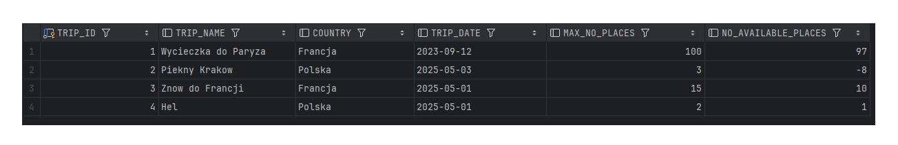

---
# Zadanie 6a  - procedury


Obsługę pola `no_available_places` należy zrealizować przy pomocy procedur
- procedura dodająca rezerwację powinna aktualizować pole `no_available_places` w tabeli trip
- podobnie procedury odpowiedzialne za zmianę statusu oraz zmianę maksymalnej liczby miejsc na wycieczkę
- należy przygotować procedury oraz jeśli jest to potrzebne, zaktualizować triggery oraz widoki


>UWAGA
Należy stworzyć nowe wersje tych widoków/procedur/triggerów (np. dodając do nazwy dopisek 6a - od numeru zadania). Poprzednie wersje procedur należy pozostawić w celu  umożliwienia weryfikacji ich poprawności. 
- może  być potrzebne wyłączenie 'poprzednich wersji' triggerów 


# Zadanie 6a  - rozwiązanie

**p_add_reservation_6a**

```sql
CREATE OR REPLACE PROCEDURE p_add_reservation_6a(
    p_trip_id IN trip.trip_id%TYPE,
    p_person_id IN person.person_id%TYPE,
    p_no_tickets IN reservation.no_tickets%TYPE
) AS
    v_trip_date trip.trip_date%TYPE;
    v_available_places trip.no_available_places%TYPE;
BEGIN
    -- Sprawdzenie czy wycieczka istnieje
    SELECT trip_date, no_available_places INTO v_trip_date, v_available_places
    FROM trip
    WHERE trip_id = p_trip_id;

    -- Sprawdzenie czy wycieczka się nie odbyła
    IF v_trip_date < SYSDATE THEN
        RAISE_APPLICATION_ERROR(-20001, 'Nie można dodać rezerwacji na wycieczkę, która już się odbyła');
    END IF;

    -- Sprawdzenie czy są dostępne miejsca
    IF v_available_places < p_no_tickets THEN
        RAISE_APPLICATION_ERROR(-20002, 'Brak wystarczającej liczby miejsc na wycieczce');
    END IF;

    -- Dodanie rezerwacji
    INSERT INTO reservation(trip_id, person_id, status, no_tickets)
    VALUES (p_trip_id, p_person_id, 'N', p_no_tickets);

    -- Aktualizacja liczby dostępnych miejsc
    UPDATE trip
    SET no_available_places = no_available_places - p_no_tickets
    WHERE trip_id = p_trip_id;

    -- Dodanie wpisu do logu
    INSERT INTO log(reservation_id, log_date, status, no_tickets)
    VALUES (s_reservation_seq.currval, SYSDATE, 'N', p_no_tickets);

    COMMIT;
EXCEPTION
    WHEN NO_DATA_FOUND THEN
        RAISE_APPLICATION_ERROR(-20003, 'Wycieczka o podanym ID nie istnieje');
    WHEN OTHERS THEN
        ROLLBACK;
        RAISE;
END;
/
```

**p_modify_reservation_status_6a**

```sql
CREATE OR REPLACE PROCEDURE p_modify_reservation_status_6a(
    p_reservation_id IN reservation.reservation_id%TYPE,
    p_status IN reservation.status%TYPE
) AS
    v_current_status reservation.status%TYPE;
    v_trip_id trip.trip_id%TYPE;
    v_no_tickets reservation.no_tickets%TYPE;
    v_trip_date trip.trip_date%TYPE;
    v_available_places trip.no_available_places%TYPE;
BEGIN
    -- Pobranie bieżących danych rezerwacji
    SELECT r.status, r.trip_id, r.no_tickets, t.trip_date, t.no_available_places
    INTO v_current_status, v_trip_id, v_no_tickets, v_trip_date, v_available_places
    FROM reservation r
    JOIN trip t ON r.trip_id = t.trip_id
    WHERE r.reservation_id = p_reservation_id;

    -- Sprawdzenie czy można zmienić status
    IF v_current_status = p_status THEN
        RETURN; -- Nic się nie zmienia, wyjście z procedury
    END IF;

    -- Jeśli próbujemy zmienić status z anulowanego (C) na inny
    IF v_current_status = 'C' AND (p_status = 'N' OR p_status = 'P') THEN
        -- Sprawdzenie czy wycieczka się nie odbyła
        IF v_trip_date < SYSDATE THEN
            RAISE_APPLICATION_ERROR(-20001, 'Nie można przywrócić rezerwacji na wycieczkę, która już się odbyła');
        END IF;

        -- Sprawdzenie czy są dostępne miejsca
        IF v_available_places < v_no_tickets THEN
            RAISE_APPLICATION_ERROR(-20002, 'Brak wystarczającej liczby miejsc na wycieczce');
        END IF;

        -- Aktualizacja liczby dostępnych miejsc
        UPDATE trip
        SET no_available_places = no_available_places - v_no_tickets
        WHERE trip_id = v_trip_id;
    END IF;

    -- Jeśli zmieniamy status na anulowany (C)
    IF p_status = 'C' AND v_current_status != 'C' THEN
        -- Zwiększenie liczby dostępnych miejsc
        UPDATE trip
        SET no_available_places = no_available_places + v_no_tickets
        WHERE trip_id = v_trip_id;
    END IF;

    -- Aktualizacja statusu rezerwacji
    UPDATE reservation
    SET status = p_status
    WHERE reservation_id = p_reservation_id;

    -- Dodanie wpisu do logu
    INSERT INTO log(reservation_id, log_date, status, no_tickets)
    VALUES (p_reservation_id, SYSDATE, p_status, v_no_tickets);

    COMMIT;
EXCEPTION
    WHEN NO_DATA_FOUND THEN
        RAISE_APPLICATION_ERROR(-20003, 'Rezerwacja o podanym ID nie istnieje');
    WHEN OTHERS THEN
        ROLLBACK;
        RAISE;
END;
/
```

**p_modify_reservation_6a**

```sql
CREATE OR REPLACE PROCEDURE p_modify_reservation_6a(
    p_reservation_id IN reservation.reservation_id%TYPE,
    p_no_tickets IN reservation.no_tickets%TYPE
) AS
    v_current_no_tickets reservation.no_tickets%TYPE;
    v_status reservation.status%TYPE;
    v_trip_id trip.trip_id%TYPE;
    v_trip_date trip.trip_date%TYPE;
    v_available_places trip.no_available_places%TYPE;
    v_tickets_diff INT;
BEGIN
    -- Pobranie bieżących danych rezerwacji
    SELECT r.no_tickets, r.status, r.trip_id, t.trip_date, t.no_available_places
    INTO v_current_no_tickets, v_status, v_trip_id, v_trip_date, v_available_places
    FROM reservation r
    JOIN trip t ON r.trip_id = t.trip_id
    WHERE r.reservation_id = p_reservation_id;

    -- Obliczenie różnicy w liczbie biletów
    v_tickets_diff := p_no_tickets - v_current_no_tickets;

    -- Sprawdzenie czy rezerwacja nie jest anulowana
    IF v_status = 'C' THEN
        RAISE_APPLICATION_ERROR(-20004, 'Nie można modyfikować anulowanej rezerwacji');
    END IF;

    -- Sprawdzenie czy wycieczka się nie odbyła
    IF v_trip_date < SYSDATE THEN
        RAISE_APPLICATION_ERROR(-20001, 'Nie można modyfikować rezerwacji na wycieczkę, która już się odbyła');
    END IF;

    -- Jeśli zwiększamy liczbę biletów, sprawdzamy dostępność
    IF v_tickets_diff > 0 AND v_available_places < v_tickets_diff THEN
        RAISE_APPLICATION_ERROR(-20002, 'Brak wystarczającej liczby miejsc na wycieczce');
    END IF;

    -- Aktualizacja liczby biletów
    UPDATE reservation
    SET no_tickets = p_no_tickets
    WHERE reservation_id = p_reservation_id;

    -- Aktualizacja liczby dostępnych miejsc
    UPDATE trip
    SET no_available_places = no_available_places - v_tickets_diff
    WHERE trip_id = v_trip_id;

    -- Dodanie wpisu do logu
    INSERT INTO log(reservation_id, log_date, status, no_tickets)
    VALUES (p_reservation_id, SYSDATE, v_status, p_no_tickets);

    COMMIT;
EXCEPTION
    WHEN NO_DATA_FOUND THEN
        RAISE_APPLICATION_ERROR(-20003, 'Rezerwacja o podanym ID nie istnieje');
    WHEN OTHERS THEN
        ROLLBACK;
        RAISE;
END;
/
```

**p_modify_max_no_places_6a**

```sql
CREATE OR REPLACE PROCEDURE p_modify_max_no_places_6a(
    p_trip_id IN trip.trip_id%TYPE,
    p_max_no_places IN trip.max_no_places%TYPE
) AS
    v_current_max_no_places trip.max_no_places%TYPE;
    v_current_available_places trip.no_available_places%TYPE;
    v_reserved_places INT;
BEGIN
    -- Pobranie bieżących danych wycieczki
    SELECT max_no_places, no_available_places
    INTO v_current_max_no_places, v_current_available_places
    FROM trip
    WHERE trip_id = p_trip_id;

    -- Obliczenie liczby zarezerwowanych miejsc
    v_reserved_places := v_current_max_no_places - v_current_available_places;

    -- Sprawdzenie czy nowa liczba miejsc nie jest mniejsza od liczby zarezerwowanych
    IF p_max_no_places < v_reserved_places THEN
        RAISE_APPLICATION_ERROR(-20005, 'Nie można zmniejszyć liczby miejsc poniżej liczby zarezerwowanych miejsc');
    END IF;

    -- Aktualizacja maksymalnej liczby miejsc
    UPDATE trip
    SET max_no_places = p_max_no_places,
        no_available_places = p_max_no_places - v_reserved_places
    WHERE trip_id = p_trip_id;

    COMMIT;
EXCEPTION
    WHEN NO_DATA_FOUND THEN
        RAISE_APPLICATION_ERROR(-20003, 'Wycieczka o podanym ID nie istnieje');
    WHEN OTHERS THEN
        ROLLBACK;
        RAISE;
END;
/
```

Prykład dodania nowej rezerwacji:
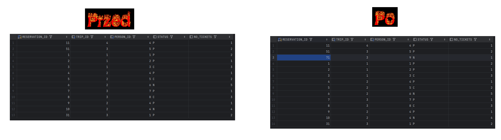

Przykład zmienienia liczby biletów dla tej rezerwacji:
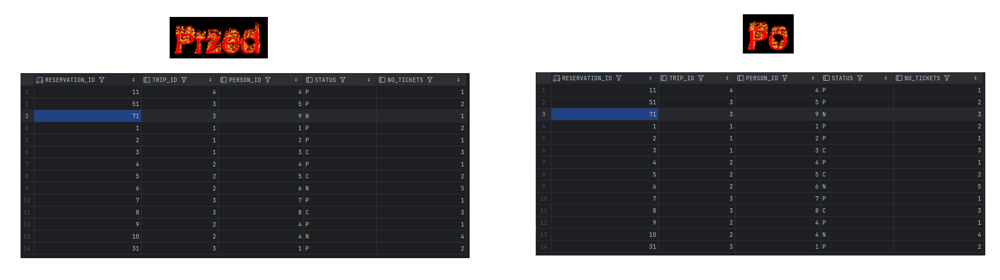

Przykład zmienienia statusu dla tej rezerwacji:
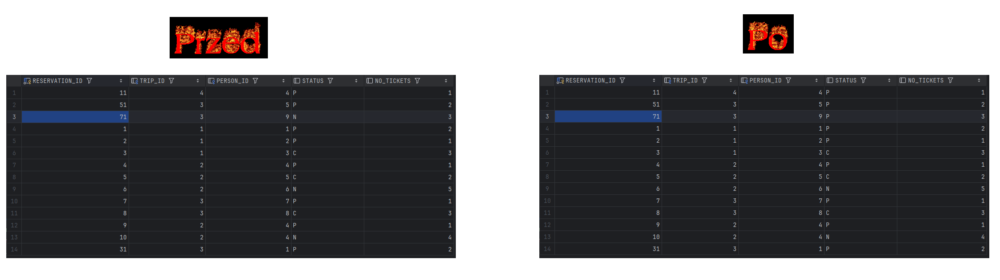

Przykład zmiany ilości miejsc dla wycieczki:
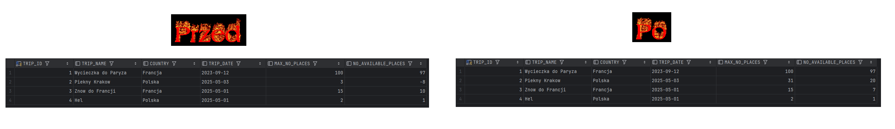

---
# Zadanie 6b -  triggery


Obsługę pola `no_available_places` należy zrealizować przy pomocy triggerów
- podczas dodawania rezerwacji trigger powinien aktualizować pole `no_available_places` w tabeli trip
- podobnie, podczas zmiany statusu rezerwacji
- należy przygotować trigger/triggery oraz jeśli jest to potrzebne, zaktualizować procedury modyfikujące dane oraz widoki


>UWAGA
Należy stworzyć nowe wersje tych widoków/procedur/triggerów (np. dodając do nazwy dopisek 6b - od numeru zadania). Poprzednie wersje procedur należy pozostawić w celu  umożliwienia weryfikacji ich poprawności. 
- może  być potrzebne wyłączenie 'poprzednich wersji' triggerów 


# Zadanie 6b  - rozwiązanie

Triggery:

**trg_reservation_insert_6b**

```sql
-- Trigger aktualizujący liczbę dostępnych miejsc po dodaniu rezerwacji
CREATE OR REPLACE TRIGGER trg_reservation_insert_6b
AFTER INSERT ON reservation
FOR EACH ROW
BEGIN
    -- Aktualizacja liczby dostępnych miejsc
    IF :NEW.status != 'C' THEN
        UPDATE trip
        SET no_available_places = no_available_places - :NEW.no_tickets
        WHERE trip_id = :NEW.trip_id;
    END IF;
END;
/
```

**trg_reservation_update_status_6b**

```sql
-- Trigger aktualizujący liczbę dostępnych miejsc po zmianie statusu rezerwacji
CREATE OR REPLACE TRIGGER trg_reservation_update_status_6b
AFTER UPDATE OF status ON reservation
FOR EACH ROW
BEGIN
    -- Jeśli zmiana statusu na anulowany (C)
    IF :NEW.status = 'C' AND :OLD.status != 'C' THEN
        UPDATE trip
        SET no_available_places = no_available_places + :NEW.no_tickets
        WHERE trip_id = :NEW.trip_id;
    -- Jeśli zmiana statusu z anulowanego (C) na inny
    ELSIF :OLD.status = 'C' AND :NEW.status != 'C' THEN
        UPDATE trip
        SET no_available_places = no_available_places - :NEW.no_tickets
        WHERE trip_id = :NEW.trip_id;
    END IF;
END;
/
```

**trg_reservation_update_tickets_6b**

```sql
-- Trigger aktualizujący liczbę dostępnych miejsc po zmianie liczby biletów
CREATE OR REPLACE TRIGGER trg_reservation_update_tickets_6b
AFTER UPDATE OF no_tickets ON reservation
FOR EACH ROW
WHEN (OLD.no_tickets != NEW.no_tickets)
BEGIN
    -- Tylko dla aktywnych rezerwacji
    IF :NEW.status != 'C' THEN
        UPDATE trip
        SET no_available_places = no_available_places - (:NEW.no_tickets - :OLD.no_tickets)
        WHERE trip_id = :NEW.trip_id;
    END IF;
END;
/
```

**trg_reservation_delete_6b**

```sql
-- Trigger kontrolujący usuwanie rezerwacji (jeśli dozwolone)
CREATE OR REPLACE TRIGGER trg_reservation_delete_6b
BEFORE DELETE ON reservation
FOR EACH ROW
BEGIN
    -- Aktualizacja liczby dostępnych miejsc jeśli rezerwacja nie była anulowana
    IF :OLD.status != 'C' THEN
        UPDATE trip
        SET no_available_places = no_available_places + :OLD.no_tickets
        WHERE trip_id = :OLD.trip_id;
    END IF;
END;
/
```

**trg_trip_update_max_places_6b**

```sql
-- Trigger kontrolujący zmianę max_no_places
CREATE OR REPLACE TRIGGER trg_trip_update_max_places_6b
BEFORE UPDATE OF max_no_places ON trip
FOR EACH ROW
DECLARE
    v_reserved_places INT;
BEGIN
    -- Obliczenie liczby zarezerwowanych miejsc
    v_reserved_places := :OLD.max_no_places - :OLD.no_available_places;
    
    -- Sprawdzenie czy nowa liczba miejsc nie jest mniejsza od liczby zarezerwowanych
    IF :NEW.max_no_places < v_reserved_places THEN
        RAISE_APPLICATION_ERROR(-20005, 'Nie można zmniejszyć liczby miejsc poniżej liczby zarezerwowanych miejsc');
    END IF;
    
    -- Aktualizacja liczby dostępnych miejsc
    :NEW.no_available_places := :NEW.max_no_places - v_reserved_places;
END;
/
```
Procedury:

**p_add_reservation_6b**

```sql
CREATE OR REPLACE PROCEDURE p_add_reservation_6b(
    p_trip_id IN trip.trip_id%TYPE,
    p_person_id IN person.person_id%TYPE,
    p_no_tickets IN reservation.no_tickets%TYPE
) AS
    v_trip_date trip.trip_date%TYPE;
    v_available_places trip.no_available_places%TYPE;
BEGIN
    -- Sprawdzenie czy wycieczka istnieje
    SELECT trip_date, no_available_places INTO v_trip_date, v_available_places
    FROM trip
    WHERE trip_id = p_trip_id;
    
    -- Sprawdzenie czy wycieczka się nie odbyła
    IF v_trip_date < SYSDATE THEN
        RAISE_APPLICATION_ERROR(-20001, 'Nie można dodać rezerwacji na wycieczkę, która już się odbyła');
    END IF;
    
    -- Sprawdzenie czy są dostępne miejsca
    IF v_available_places < p_no_tickets THEN
        RAISE_APPLICATION_ERROR(-20002, 'Brak wystarczającej liczby miejsc na wycieczce');
    END IF;
    
    -- Dodanie rezerwacji (triggery zajmą się aktualizacją no_available_places)
    INSERT INTO reservation(trip_id, person_id, status, no_tickets)
    VALUES (p_trip_id, p_person_id, 'N', p_no_tickets);
    
    -- Dodanie wpisu do logu
    INSERT INTO log(reservation_id, log_date, status, no_tickets)
    VALUES (s_reservation_seq.currval, SYSDATE, 'N', p_no_tickets);
    
    COMMIT;
EXCEPTION
    WHEN NO_DATA_FOUND THEN
        RAISE_APPLICATION_ERROR(-20003, 'Wycieczka o podanym ID nie istnieje');
    WHEN OTHERS THEN
        ROLLBACK;
        RAISE;
END;
/
```

**p_modify_reservation_status_6b**

```sql
CREATE OR REPLACE PROCEDURE p_modify_reservation_status_6b(
    p_reservation_id IN reservation.reservation_id%TYPE,
    p_status IN reservation.status%TYPE
) AS
    v_current_status reservation.status%TYPE;
    v_trip_id trip.trip_id%TYPE;
    v_no_tickets reservation.no_tickets%TYPE;
    v_trip_date trip.trip_date%TYPE;
    v_available_places trip.no_available_places%TYPE;
BEGIN
    -- Pobranie bieżących danych rezerwacji
    SELECT r.status, r.trip_id, r.no_tickets, t.trip_date, t.no_available_places
    INTO v_current_status, v_trip_id, v_no_tickets, v_trip_date, v_available_places
    FROM reservation r
    JOIN trip t ON r.trip_id = t.trip_id
    WHERE r.reservation_id = p_reservation_id;
    
    -- Sprawdzenie czy można zmienić status
    IF v_current_status = p_status THEN
        RETURN; -- Nic się nie zmienia, wyjście z procedury
    END IF;
    
    -- Jeśli próbujemy zmienić status z anulowanego (C) na inny
    IF v_current_status = 'C' AND (p_status = 'N' OR p_status = 'P') THEN
        -- Sprawdzenie czy wycieczka się nie odbyła
        IF v_trip_date < SYSDATE THEN
            RAISE_APPLICATION_ERROR(-20001, 'Nie można przywrócić rezerwacji na wycieczkę, która już się odbyła');
        END IF;
        
        -- Sprawdzenie czy są dostępne miejsca
        IF v_available_places < v_no_tickets THEN
            RAISE_APPLICATION_ERROR(-20002, 'Brak wystarczającej liczby miejsc na wycieczce');
        END IF;
    END IF;
    
    -- Aktualizacja statusu rezerwacji (triggery zajmą się aktualizacją no_available_places)
    UPDATE reservation
    SET status = p_status
    WHERE reservation_id = p_reservation_id;
    
    -- Dodanie wpisu do logu
    INSERT INTO log(reservation_id, log_date, status, no_tickets)
    VALUES (p_reservation_id, SYSDATE, p_status, v_no_tickets);
    
    COMMIT;
EXCEPTION
    WHEN NO_DATA_FOUND THEN
        RAISE_APPLICATION_ERROR(-20003, 'Rezerwacja o podanym ID nie istnieje');
    WHEN OTHERS THEN
        ROLLBACK;
        RAISE;
END;
/
```

**p_modify_reservation_6b**

```sql
CREATE OR REPLACE PROCEDURE p_modify_reservation_6b(
    p_reservation_id IN reservation.reservation_id%TYPE,
    p_no_tickets IN reservation.no_tickets%TYPE
) AS
    v_current_no_tickets reservation.no_tickets%TYPE;
    v_status reservation.status%TYPE;
    v_trip_id trip.trip_id%TYPE;
    v_trip_date trip.trip_date%TYPE;
    v_available_places trip.no_available_places%TYPE;
    v_tickets_diff INT;
BEGIN
    -- Pobranie bieżących danych rezerwacji
    SELECT r.no_tickets, r.status, r.trip_id, t.trip_date, t.no_available_places
    INTO v_current_no_tickets, v_status, v_trip_id, v_trip_date, v_available_places
    FROM reservation r
    JOIN trip t ON r.trip_id = t.trip_id
    WHERE r.reservation_id = p_reservation_id;
    
    -- Obliczenie różnicy w liczbie biletów
    v_tickets_diff := p_no_tickets - v_current_no_tickets;
    
    -- Sprawdzenie czy rezerwacja nie jest anulowana
    IF v_status = 'C' THEN
        RAISE_APPLICATION_ERROR(-20004, 'Nie można modyfikować anulowanej rezerwacji');
    END IF;
    
    -- Sprawdzenie czy wycieczka się nie odbyła
    IF v_trip_date < SYSDATE THEN
        RAISE_APPLICATION_ERROR(-20001, 'Nie można modyfikować rezerwacji na wycieczkę, która już się odbyła');
    END IF;
    
    -- Jeśli zwiększamy liczbę biletów, sprawdzamy dostępność
    IF v_tickets_diff > 0 AND v_available_places < v_tickets_diff THEN
        RAISE_APPLICATION_ERROR(-20002, 'Brak wystarczającej liczby miejsc na wycieczce');
    END IF;
    
    -- Aktualizacja liczby biletów (triggery zajmą się aktualizacją no_available_places)
    UPDATE reservation
    SET no_tickets = p_no_tickets
    WHERE reservation_id = p_reservation_id;
    
    -- Dodanie wpisu do logu
    INSERT INTO log(reservation_id, log_date, status, no_tickets)
    VALUES (p_reservation_id, SYSDATE, v_status, p_no_tickets);
    
    COMMIT;
EXCEPTION
    WHEN NO_DATA_FOUND THEN
        RAISE_APPLICATION_ERROR(-20003, 'Rezerwacja o podanym ID nie istnieje');
    WHEN OTHERS THEN
        ROLLBACK;
        RAISE;
END;
/
```

**p_modify_max_no_places_6b**

```sql
CREATE OR REPLACE PROCEDURE p_modify_max_no_places_6b(
    p_trip_id IN trip.trip_id%TYPE,
    p_max_no_places IN trip.max_no_places%TYPE
) AS
BEGIN
    -- Aktualizacja max_no_places (trigger zajmie się kontrolą i aktualizacją no_available_places)
    UPDATE trip
    SET max_no_places = p_max_no_places
    WHERE trip_id = p_trip_id;
    
    COMMIT;
EXCEPTION
    WHEN NO_DATA_FOUND THEN
        RAISE_APPLICATION_ERROR(-20003, 'Wycieczka o podanym ID nie istnieje');
    WHEN OTHERS THEN
        ROLLBACK;
        RAISE;
END;
/
```

Przykład zmiany ilości miejsc dla wycieczki:


Prykład dodania nowej rezerwacji:


Przykład zmienienia liczby biletów dla tej rezerwacji:


Przykład zmienienia statusu dla tej rezerwacji:


# Zadanie 7 - podsumowanie

Porównaj sposób programowania w systemie Oracle PL/SQL ze znanym ci systemem/językiem MS Sqlserver T-SQL

```sql

-- komentarz ...

```